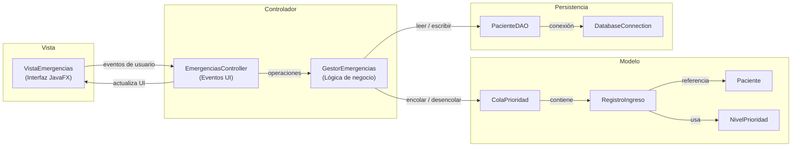
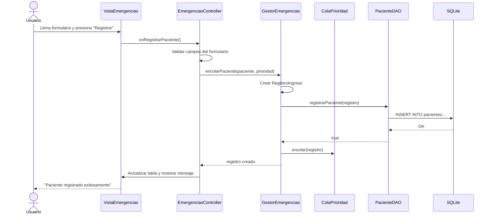

# Manual Técnico — Sistema de Emergencias Hospitalarias

**Versión:** 1.0  
**Fecha:** Mayo 2026  
**Tecnologías:** Java 17, JavaFX 21, SQLite, Maven

---

## 1. Descripción del Diseño del Sistema

### 1.1 Propósito

El Sistema de Emergencias Hospitalarias es una aplicación de escritorio diseñada para gestionar el ingreso y atención de pacientes en el área de emergencias de un hospital. El sistema permite:

- **Registrar pacientes** con sus datos personales y síntomas.
- **Asignar un nivel de prioridad** de triaje (Critical, High, Medium, Low).
- **Organizar la atención** mediante una cola de prioridad que garantiza que los pacientes más urgentes sean atendidos primero.
- **Persistir los datos** en una base de datos SQLite para que la información no se pierda entre ejecuciones.

### 1.2 Tecnologías Utilizadas

| Tecnología | Propósito |
|---|---|
| **Java 17** | Lenguaje de programación principal |
| **JavaFX 21** | Framework para la interfaz gráfica de usuario |
| **SQLite** | Base de datos embebida para persistencia |
| **Maven** | Gestión de dependencias y compilación |
| **JDBC** | Conexión entre Java y SQLite |

### 1.3 Estructura de Archivos

```
Proyectofinal2/
├── pom.xml                                    ← Configuración Maven
├── emergencias.db                             ← Base de datos SQLite (autogenerada)
└── src/main/java/com/hospital/emergencias/
    ├── Main.java                              ← Punto de entrada
    ├── modelo/
    │   ├── Paciente.java                      ← Datos personales del paciente
    │   ├── NivelPrioridad.java                ← Enum de niveles de prioridad
    │   ├── RegistroIngreso.java               ← Registro de ingreso a emergencias
    │   └── ColaPrioridad.java                 ← Cola de prioridad con Comparator
    ├── controlador/
    │   ├── GestorEmergencias.java             ← Lógica de negocio
    │   └── EmergenciasController.java         ← Manejo de eventos de la interfaz
    ├── vista/
    │   └── VistaEmergencias.java              ← Interfaz gráfica JavaFX
    └── persistencia/
        ├── DatabaseConnection.java            ← Conexión Singleton a SQLite
        └── PacienteDAO.java                   ← Operaciones CRUD
```

---

## 2. Explicación del Uso de MVC

El sistema implementa el patrón de diseño **Modelo–Vista–Controlador (MVC)**, que separa la aplicación en tres capas con responsabilidades bien definidas, más una capa adicional de persistencia.

### 2.1 Diagrama del Patrón MVC



### 2.2 Responsabilidades por Capa

#### Modelo (`modelo/`)

Contiene las **clases del dominio** y la **lógica de la estructura de datos**. No tiene dependencias con la interfaz gráfica ni con la base de datos.

| Clase | Responsabilidad |
|---|---|
| `Paciente` | Encapsula los datos personales del paciente (nombre, edad, DPI, síntomas). Aplica validación en los setters. |
| `NivelPrioridad` | Enum que define los 4 niveles de prioridad del triaje con valores numéricos para ordenamiento. |
| `RegistroIngreso` | Representa un evento de ingreso a emergencias. Vincula un `Paciente` con su prioridad, hora de ingreso y estado de atención. |
| `ColaPrioridad` | Encapsula la `PriorityQueue` de Java con un `Comparator` personalizado que ordena por prioridad médica y hora de ingreso. |

#### Vista (`vista/`)

Se encarga **exclusivamente** de la presentación visual. No contiene lógica de negocio.

| Clase | Responsabilidad |
|---|---|
| `VistaEmergencias` | Construye la interfaz JavaFX: formulario de registro, tabla de pacientes en espera, botones de acción y barra de estado. Delega los eventos al controlador. |

#### Controlador (`controlador/`)

Actúa como **intermediario** entre la vista y el modelo. Maneja los eventos del usuario y coordina las operaciones.

| Clase | Responsabilidad |
|---|---|
| `EmergenciasController` | Captura los eventos de los botones, valida los datos del formulario, invoca al `GestorEmergencias` y actualiza la interfaz con los resultados. |
| `GestorEmergencias` | Contiene la lógica de negocio principal: encolar pacientes, atender al siguiente, y coordinar la persistencia con el DAO. |

#### Persistencia (`persistencia/`)

Maneja el **acceso a la base de datos**, aislando las consultas SQL del resto del sistema.

| Clase | Responsabilidad |
|---|---|
| `DatabaseConnection` | Implementa el **patrón Singleton** para mantener una única conexión a SQLite. Crea la tabla automáticamente al iniciar. |
| `PacienteDAO` | Data Access Object con 3 métodos usando `PreparedStatement`: registrar, marcar como atendido, y obtener pacientes en espera. |

### 2.3 Flujo de una Operación (Ejemplo: Registrar Paciente)



---

## 3. Diagrama UML de Clases

```mermaid
classDiagram
    class Paciente {
        -String nombreCompleto
        -int edad
        -String dpi
        -String sintomas
        +Paciente(nombreCompleto, edad, dpi, sintomas)
        +getNombreCompleto() String
        +getEdad() int
        +getDpi() String
        +getSintomas() String
        +setNombreCompleto(String) void
        +setEdad(int) void
        +setDpi(String) void
        +setSintomas(String) void
        +toString() String
    }

    class NivelPrioridad {
        <<enumeration>>
        CRITICAL(1, "Critical")
        HIGH(2, "High")
        MEDIUM(3, "Medium")
        LOW(4, "Low")
        -int valor
        -String etiqueta
        +getValor() int
        +getEtiqueta() String
        +desdeTexto(String) NivelPrioridad$
        +toString() String
    }

    class RegistroIngreso {
        -int id
        -Paciente paciente
        -NivelPrioridad prioridad
        -LocalDateTime horaIngreso
        -boolean atendido
        -AtomicInteger GENERADOR_ID$
        +RegistroIngreso(paciente, prioridad)
        +RegistroIngreso(id, paciente, prioridad, horaIngreso, atendido)
        +getId() int
        +getPaciente() Paciente
        +getPrioridad() NivelPrioridad
        +getPrioridadTexto() String
        +getHoraIngreso() LocalDateTime
        +isAtendido() boolean
        +getNombreCompleto() String
        +getEdad() int
        +getDpi() String
        +getSintomas() String
        +setAtendido(boolean) void
        +toString() String
    }

    class ColaPrioridad {
        -PriorityQueue~RegistroIngreso~ cola
        -Comparator~RegistroIngreso~ COMPARADOR_TRIAJE$
        +ColaPrioridad()
        +encolar(RegistroIngreso) void
        +desencolar() RegistroIngreso
        +verSiguiente() RegistroIngreso
        +obtenerTodosOrdenados() List~RegistroIngreso~
        +cantidadEnEspera() int
        +estaVacia() boolean
    }

    class GestorEmergencias {
        -ColaPrioridad colaPrioridad
        -PacienteDAO pacienteDAO
        +GestorEmergencias()
        +encolarPaciente(Paciente, NivelPrioridad) RegistroIngreso
        +atenderSiguiente() RegistroIngreso
        +obtenerRegistrosOrdenados() List~RegistroIngreso~
        +verSiguiente() RegistroIngreso
        +cantidadEnEspera() int
        +colaVacia() boolean
        -cargarPacientesEnEspera() void
    }

    class EmergenciasController {
        -GestorEmergencias gestor
        -TextField txtNombre
        -TextField txtEdad
        -TextField txtDpi
        -TextField txtSintomas
        -ComboBox~String~ cmbPrioridad
        -TableView~RegistroIngreso~ tablaPacientes
        -ObservableList~RegistroIngreso~ listaPacientes
        -Label lblEstado
        +onRegistrarPaciente() void
        +onAtenderSiguiente() void
        +actualizarTabla() void
        -limpiarFormulario() void
    }

    class VistaEmergencias {
        -EmergenciasController controller
        -ObservableList~RegistroIngreso~ listaPacientes
        -TextField txtNombre, txtEdad, txtDpi, txtSintomas
        -ComboBox~String~ cmbPrioridad
        -TableView~RegistroIngreso~ tablaPacientes
        -Label lblEstado
        +start(Stage) void
        -crearFormulario() GridPane
        -crearBotones() HBox
        -crearTabla() TableView
    }

    class DatabaseConnection {
        -Connection conexion
        -DatabaseConnection instancia$
        -String URL$
        -DatabaseConnection()
        +getInstancia() DatabaseConnection$
        +getConexion() Connection
        +cerrarConexion() void
        -crearTabla() void
    }

    class PacienteDAO {
        -Connection conexion
        -String SQL_INSERTAR$
        -String SQL_MARCAR_ATENDIDO$
        -String SQL_EN_ESPERA$
        +PacienteDAO()
        +registrarPaciente(RegistroIngreso) boolean
        +marcarComoAtendido(int) boolean
        +obtenerPacientesEnEspera() List~RegistroIngreso~
        -mapearResultSet(ResultSet) RegistroIngreso
    }

    RegistroIngreso --> Paciente : contiene
    RegistroIngreso --> NivelPrioridad : usa
    ColaPrioridad --> RegistroIngreso : almacena
    GestorEmergencias --> ColaPrioridad : usa
    GestorEmergencias --> PacienteDAO : usa
    EmergenciasController --> GestorEmergencias : delega
    VistaEmergencias --> EmergenciasController : eventos
    PacienteDAO --> DatabaseConnection : conexión
    PacienteDAO --> RegistroIngreso : mapea
```



---

## 4. Explicación de la Cola de Prioridad Implementada

### 4.1 ¿Qué es una Cola de Prioridad?

Una **cola de prioridad** es una estructura de datos donde cada elemento tiene una prioridad asociada. A diferencia de una cola normal (FIFO — primero en entrar, primero en salir), en una cola de prioridad **el elemento con mayor prioridad se atiende primero**, sin importar el orden de llegada.

En Java, se implementa con la clase `java.util.PriorityQueue`, que internamente utiliza un **min-heap** (árbol binario donde el padre siempre es menor o igual que sus hijos).

### 4.2 Implementación en el Sistema

La cola de prioridad está encapsulada en la clase `ColaPrioridad` y utiliza un `Comparator<RegistroIngreso>` personalizado con dos reglas de ordenamiento:

#### Regla 1: Ordenar por Prioridad Médica

Cada nivel de prioridad tiene un valor numérico asignado en el enum `NivelPrioridad`:

| Nivel | Valor Numérico | Orden de Atención |
|---|---|---|
| `CRITICAL` | 1 | 🔴 Se atiende primero |
| `HIGH` | 2 | 🟠 Segunda prioridad |
| `MEDIUM` | 3 | 🟡 Tercera prioridad |
| `LOW` | 4 | 🟢 Se atiende al final |

**Menor valor numérico = mayor urgencia.** El `Comparator` usa `Integer.compare()` para ordenar de menor a mayor.

#### Regla 2: Desempate por Hora de Ingreso

Si dos pacientes tienen **la misma prioridad**, se desempata por **hora de ingreso**: el que llegó primero (hora más antigua) se atiende primero. Esto garantiza justicia dentro del mismo nivel de urgencia.

### 4.3 Código del Comparador

```java
private static final Comparator<RegistroIngreso> COMPARADOR_TRIAJE = (r1, r2) -> {
    // Regla 1: comparar por prioridad (menor valor = más urgente)
    int cmpPrioridad = Integer.compare(
            r1.getPrioridad().getValor(),
            r2.getPrioridad().getValor()
    );

    if (cmpPrioridad != 0) {
        return cmpPrioridad;
    }

    // Regla 2: misma prioridad → desempate por hora de ingreso
    return r1.getHoraIngreso().compareTo(r2.getHoraIngreso());
};
```

### 4.4 Ejemplo de Funcionamiento

Supongamos que se registran los siguientes pacientes:

| Orden de Llegada | Paciente | Prioridad | Hora |
|---|---|---|---|
| 1° | María López | Medium | 08:00 |
| 2° | Juan Pérez | Critical | 08:15 |
| 3° | Ana García | Medium | 08:05 |
| 4° | Carlos Ruiz | High | 08:10 |

La cola de prioridad los ordena así para atención:

| Posición | Paciente | Prioridad | Razón |
|---|---|---|---|
| 1° | Juan Pérez | Critical (1) | Mayor prioridad médica |
| 2° | Carlos Ruiz | High (2) | Segunda prioridad |
| 3° | María López | Medium (3) | Misma prioridad que Ana, pero llegó a las 08:00 |
| 4° | Ana García | Medium (3) | Misma prioridad que María, pero llegó a las 08:05 |

### 4.5 Operaciones de la Cola

| Método | Complejidad | Descripción |
|---|---|---|
| `encolar()` | O(log n) | Inserta y reordena el heap |
| `desencolar()` | O(log n) | Extrae el mínimo y reordena |
| `verSiguiente()` | O(1) | Consulta el mínimo sin extraer |
| `obtenerTodosOrdenados()` | O(n log n) | Copia y ordena para visualización |

---

## 5. Script SQL de la Base de Datos

### 5.1 Creación de la Tabla

```sql
CREATE TABLE IF NOT EXISTS pacientes (
    id              INTEGER PRIMARY KEY AUTOINCREMENT,
    nombreCompleto  TEXT    NOT NULL,
    edad            INTEGER NOT NULL,
    dpi             TEXT    NOT NULL,
    sintomas        TEXT    NOT NULL,
    prioridad       TEXT    NOT NULL CHECK(prioridad IN ('Critical','High','Medium','Low')),
    horaIngreso     TEXT    NOT NULL,
    atendido        INTEGER NOT NULL DEFAULT 0
);
```

### 5.2 Descripción de las Columnas

| Columna | Tipo | Restricción | Descripción |
|---|---|---|---|
| `id` | INTEGER | PRIMARY KEY AUTOINCREMENT | Identificador único autogenerado |
| `nombreCompleto` | TEXT | NOT NULL | Nombre completo del paciente |
| `edad` | INTEGER | NOT NULL | Edad del paciente en años |
| `dpi` | TEXT | NOT NULL | Documento Personal de Identificación |
| `sintomas` | TEXT | NOT NULL | Descripción de los síntomas |
| `prioridad` | TEXT | NOT NULL + CHECK | Nivel de triaje (solo valores permitidos) |
| `horaIngreso` | TEXT | NOT NULL | Fecha/hora en formato ISO-8601 |
| `atendido` | INTEGER | NOT NULL DEFAULT 0 | Estado: 0 = en espera, 1 = atendido |

### 5.3 Consultas Preparadas (PreparedStatement)

#### Insertar un nuevo paciente
```sql
INSERT INTO pacientes (nombreCompleto, edad, dpi, sintomas, prioridad, horaIngreso, atendido)
VALUES (?, ?, ?, ?, ?, ?, 0);
```

#### Marcar paciente como atendido
```sql
UPDATE pacientes SET atendido = 1 WHERE id = ?;
```

#### Obtener pacientes en espera
```sql
SELECT id, nombreCompleto, edad, dpi, sintomas, prioridad, horaIngreso, atendido
FROM pacientes
WHERE atendido = 0
ORDER BY horaIngreso ASC;
```

### 5.4 Notas de Diseño de la Base de Datos

- **SQLite** se eligió por ser una base de datos embebida que no requiere instalación de un servidor externo. El archivo `emergencias.db` se crea automáticamente en la raíz del proyecto.

- **`horaIngreso` como TEXT**: SQLite no tiene un tipo de dato nativo para fechas. Se almacena en formato ISO-8601 (ej: `2026-05-26T22:15:00`), que es ordenable lexicográficamente y fácilmente parseable con `LocalDateTime.parse()`.

- **`atendido` como INTEGER**: SQLite no tiene un tipo booleano nativo. Se usa 0 para `false` (en espera) y 1 para `true` (atendido).

- **CHECK constraint en `prioridad`**: La base de datos valida que solo se inserten los valores permitidos (`Critical`, `High`, `Medium`, `Low`), creando una doble capa de validación junto con el enum `NivelPrioridad` en Java.

- **Patrón Singleton** en `DatabaseConnection`: Garantiza que exista una única conexión activa a la base de datos durante toda la ejecución, evitando problemas de conexiones múltiples y optimizando recursos.

---

## 6. Patrones de Diseño Utilizados

| Patrón | Clase | Justificación |
|---|---|---|
| **MVC** | Todo el proyecto | Separación de responsabilidades entre interfaz, lógica y datos |
| **Singleton** | `DatabaseConnection` | Una única conexión a la BD durante toda la ejecución |
| **DAO** | `PacienteDAO` | Aislamiento de las operaciones SQL del resto del sistema |
| **Observer** | `ObservableList` (JavaFX) | La tabla se actualiza automáticamente cuando cambia la lista |

---

## 7. Requisitos para Ejecutar

### 7.1 Prerrequisitos
- **JDK 17** o superior instalado
- **Apache Maven** 3.6+ instalado
- Conexión a internet (solo la primera vez, para descargar dependencias)

### 7.2 Comando de Ejecución
```bash
mvn javafx:run
```

Maven descarga automáticamente JavaFX y SQLite JDBC la primera vez. Las ejecuciones posteriores son instantáneas.

### 7.3 Resetear la Base de Datos
Para comenzar con una base de datos limpia, eliminar el archivo `emergencias.db` de la raíz del proyecto. Se recreará automáticamente en la siguiente ejecución.
